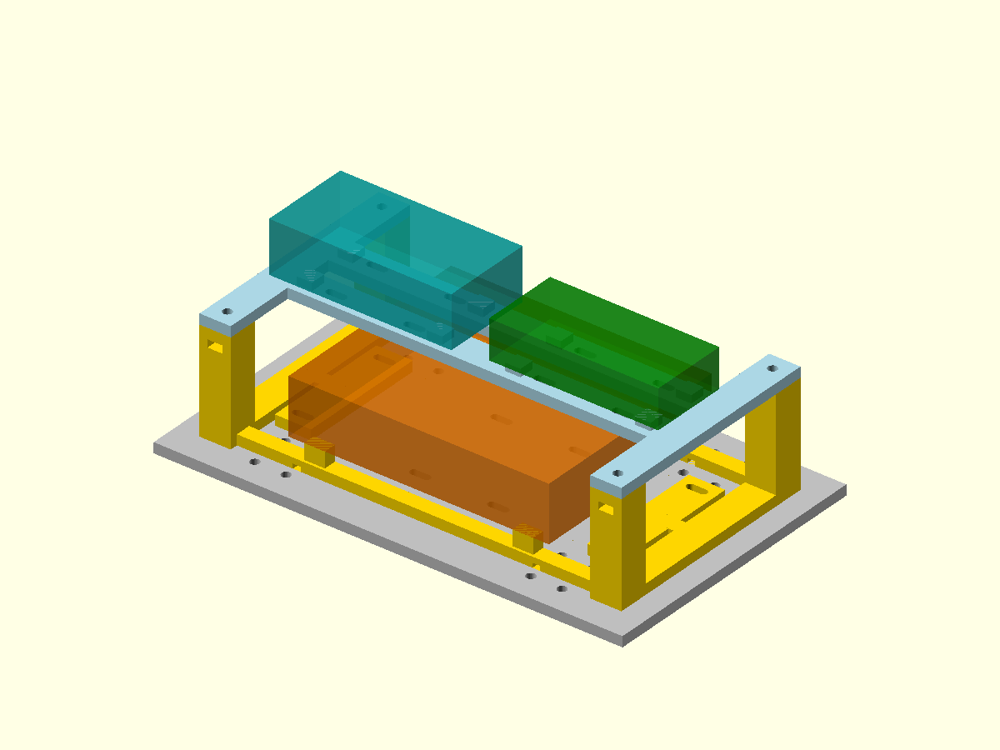

# Removable two-tier electronics carrier — MEC-167

Working CAD:mechanical/prototype-electronics-carrier.scad. It uses the optional
MEC-166 electronics deck and keeps all16 chassis fixing paths accessible.
The amber lower block is the100 x80mm PAD2 reservation; teal/green upper blocks
are the unmeasured ESP32/PCA9685 envelopes. Blocks show reserved occupied space,
not exact boards or released fit. The mounting system remains optional.

## Print and assemble

Print one prototype-electronics-carrier-base.stl and one
prototype-electronics-carrier-shelf.stl, both flat as exported. Each is one
closed connected mesh and fits the K2 Pro bed:162 x88mm planform; base40mm tall,
shelf7mm tall. Use PETG with0.4mm nozzle/0.2mm layers and conservative walls.
The base has side-loading nut pockets with short bridged roofs; inspect/clear
these before inserting nuts. Slicer mass supersedes the solid CAD estimate.
No structural FEA or load qualification is implied. Remove the upper shelf
for access to the lower board and underside wiring.

Fit four M3 nuts through the outside-facing base pockets, flats aligned with
the5.9mm channel. Place the shelf on its columns, then use four M3 x12 bolts
with one ordinary washer each. Check printed pockets and screw engagement;
do not force a nut into a tight print. Nominal screws stay inside the columns,
without protruding into the deck. These are additional option hardware.

Two narrow ties,width<=2.5mm,attach the base through paired deck/base slots at
x=+/-60,y=+/-20mm. Start with ties about150mm or longer and confirm loop length.
Thread before closing the chassis. Underside relief channels allow two more
lower-PCB ties at x=+/-46mm. Each must cross a bare PCB margin without pinching
jumpers. No purchased PCB mounting-hole pattern is assumed.

Upper shelf strap lanes x=-55,-25,25,55mm through y=+/-10mm allow up to four
board ties. Choose only lanes over actual blank PCB regions or safe insulating
adapters; move boards or use verified mounting holes if a lane crosses hardware.
Never strap over components,solder,USB sockets or the ESP32 antenna.
Conditional maximum:eight narrow ties (two carrier,two lower board,four upper
boards), replacing the earlier generic four-tie mount allowance if adopted.
Leg cable ties are separate. Reuse stock rather than buying another pack.

## Geometry and service access

Relative to carrier bottom, lower-PCB underside is10mm, giving6mm above its
rail surfaces for solder/jumpers. The populated reservation includes1.6mm PCB
plus20mm component height and ends at31.6mm. Shelf underside40mm leaves8.4mm
nominal separation. Upper PCB undersides47mm leave3mm above shelf rails.
Actual solder/socket/header height and wires may need different support pads.

ESP32 claim70 x35 x20mm is centred x=-40; PCA claim65 x30 x15mm is centred
x=40. Nominal edge gap12.5mm. Verify USB/antenna/header access on actual boards.
No exact PCB holes,connectors,battery/BEC or power-star mounting is asserted.
Motor power uses the separate rated star,never this perfboard or PCA tracks.
Route and restrain wiring before any joint motion.

## Checks and limits

Run `node mechanical/check-electronics-carrier.mjs`. Both meshes are closed,
connected and bed-oriented.384 hole,nut-entry,strap,underside-channel,board-pad
and chassis fixing paths pass. Fresh CGAL intersection with all three nominal
board envelopes is empty;0.001mm relief excludes intended support-face contact.
The checker rejects CGAL errors/warnings and unexpected probe meshes.
Preview rendered and visually inspected. Full servo travel/cable sweep and
printed stiffness/physical fit have not been tested.

Combined solid PETG CAD mass is79.8g,not an actual print measurement. The robot
screen already exceeds2kg at2.178kg. This option is not added to the93-piece
robot manifest or mass record. If adopted,use the electronics deck instead of
the original deck,add these two prints and measured hardware/masses,and recheck
complete2kg budget. Manufacturing remains the MFG-003 first-leg checkpoint.
