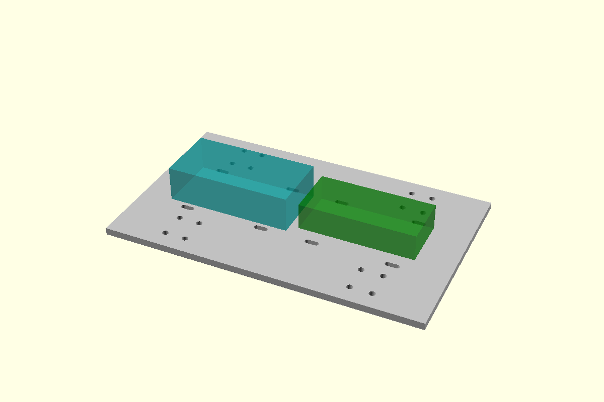

# Universal electronics attachment deck — MEC-166

Working option: mechanical/prototype-electronics-deck.scad and its STL.
It replaces the original chassis deck, retaining180 x110 x4mm and the16 M3
chassis fixings. Eight8 x3mm through-slots form four strap lanes at x=-60,-15,
15,60mm and y=+/-20mm. The single-leg MFG-003 kit is unchanged.

Use four narrow cable ties, nominal width2.5mm or less, one per paired lane.
Reuse an existing tie pack. The slots attach removable insulating carriers or
mounts; they are not mounting holes for a guessed PCB. Do not cinch a tie over
components, exposed solder joints, connectors or the ESP32 antenna. Keep bare
PCB undersides clear of the deck using suitable insulating supports; the3mm
space shown below each reservation is only a starting layout allowance.
Supports and actual connector/cable access must be checked against your boards.
No PCB hole pattern, direct-board fit or completed mount is claimed.

The teal70 x35 x20mm and green65 x30 x15mm blocks reuse the existing unmeasured
ESP32/PCA9685 space claims. Keep USB, headers and the physical servo-power
cutoff accessible. High-current wiring still uses the separate rated power
star; the PCA board and deck slots are not servo-current distribution parts.
No battery, regulator or electrical component is selected by this task.

Print flat as exported. Use the same conservative PLA+/PETG process as other
prototype plates and inspect small slot layers. The deck itself adds no raised
geometry or support requirement. Check tie passage and fixing washer clearance
on a print before fitting electronics. Fit/load remains NOT_PERFORMED.

Check: node mechanical/check-electronics-deck.mjs. The actual STL is closed,
connected and bed-sized;169 mesh rays test slots, side walls, retained fixings
and central material. Minimum slot-to-fixing ligament is6.75mm. Volume removal
matches eight slots. The variant only removes material from the old deck, so
it adds no geometry to the previously screened nominal deck/leg clearance.
This does not qualify electronics clearance, stiffness or loaded operation.

The option is not yet substituted into the93-piece four-leg plan or mass record.
Use one deck, not both, if later adopting it. Manufacturing stays at MFG-003
until a requested build checkpoint includes this chassis option.

MEC-167 now provides an optional two-tier printed carrier:
[electronics carrier](electronics-carrier.md). Its specific strap plan replaces
the generic four-tie allowance when adopted. Actual board fit/mass remain
pending; no manufacturing or robot-manifest substitution.

Preferred working attachment is now [three single-level sleds](electronics-sleds.md)
using all four existing strap lanes. It replaces the stacked carrier when
nominal single-level board/connector fit proves acceptable on actual hardware.
