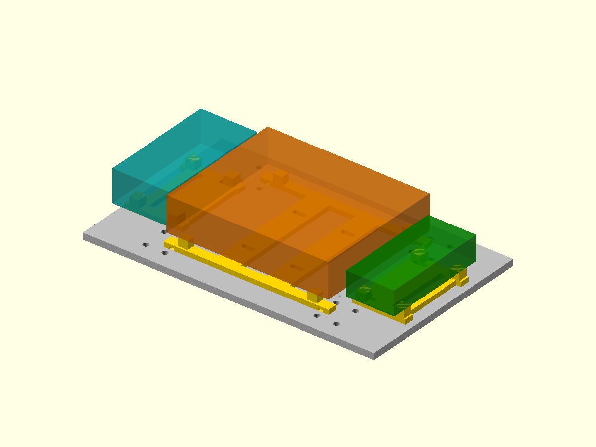

# Simple single-level electronics mounts — MEC-168

Preferred working mount option: three small insulating frames on the existing
180 x110mm electronics deck. This replaces the need for a stacked carrier
unless actual board/connector fit proves otherwise. Provisional controller
space claims are rotated90degrees; no actual PCB hole pattern is assumed.
No battery, BEC or motor-power star is packaged by this option.

Source:mechanical/prototype-electronics-sleds.scad.
Print one each of prototype-electronics-sled-perfboard.stl,
prototype-electronics-sled-esp32.stl and prototype-electronics-sled-pca9685.stl.
All print flat on their exported bed faces,8mm tall,without nut pockets or
added M3 hardware. Use PETG,0.4mm nozzle/0.2mm layers and conservative walls.
Inspect narrow slots and underside tie relief. Dry fit before buying/printing
any quantity. Boards rest on insulating pads8mm above the deck,5mm above rails;
keep solder/insulated jumpers within that underside space.

## Position and secure

| Frame | Centre relative to deck | Board space reservation |
| --- | --- | --- |
| ESP32 | x=-70,y=0 |35 x70 x20mm,rotated in plan |
| Perfboard | x=0,y=0 |100 x80 x21.6mm populated |
| PCA9685 | x=70,y=0 |30 x65 x15mm,rotated in plan |

The three printed frames occupy174 x82mm overall. Nominal populated height
above deck is29.6mm. Board edge gaps are2.5mm and5mm; actual headers,USB plugs,
antenna and cable bends must be checked. Move/modify the provisional frames
if these spaces are inadequate. Do not infer connector accessibility from
rectangular reservations. There is no body travel/cable sweep qualification.

Four narrow ties,width<=2.5mm,secure frames through existing paired deck slots:
ESP lane x=-60;perfboard lanes x=-15 and15;PCA lane x=60;all at y=+/-20mm.
The straps cross the printed beams below the boards,not populated board faces.
Thread before closing the chassis. Choose actual tie length for the loop;
about150mm or longer is a starting stock assumption,not a verified purchase.

Up to six additional ties secure the boards (two each),only across confirmed
blank PCB areas or safe insulating adapters. Perfboard ties can use the x=+/-46
underside relief channels. Controller boards may need verified mounting holes
or separate insulating adapters if no blank strap lane exists. Never cinch
across components,USB/headers,solder or antenna. Actual retention remains
untested. Conditional maximum ten ties replaces earlier generic four or stacked
eight electronics-mount ties; leg ties are separate. Reuse suitable stock.

The frames leave sixteen nominal7mm fixing-head paths clear. An assumed4mm
head/washer height fits below the8mm PCB underside. Actual head/washer height
must be checked. Boards cover some screwdriver access:turn power off and lift
removable boards/frames for chassis servicing. This tradeoff reduces hardware,
height and plastic compared with the stacked alternative.

## Validation and mass

Run `node mechanical/check-electronics-sleds.mjs`. Three meshes are closed,
connected and bed-oriented.472 strap/support/fixing/relief checks pass;placed
frame bounds do not overlap and lie inside the deck. Fresh CGAL intersection
with all three board reservations is empty (0.001mm support-face relief).
Preview was rendered and visually inspected. Physical fit/retention is pending.

Combined solid PETG volume corresponds to24.5g,versus79.8g for the two-tier
option:55.3g less solid CAD material and no four M3 bolt/nut/washer sets.
These are comparable CAD volumes,not measured print masses. Slicer/scale values
supersede them. The integrated robot estimate remains2.178kg,above2kg;the
frames are not adopted in its93-piece manifest or mass record. The first-leg
manufacturing pack remains MFG-003. If adopting later,use one electronics
mount option,replace the deck once,and account for all actual print/hardware
masses rather than adding both alternatives.
