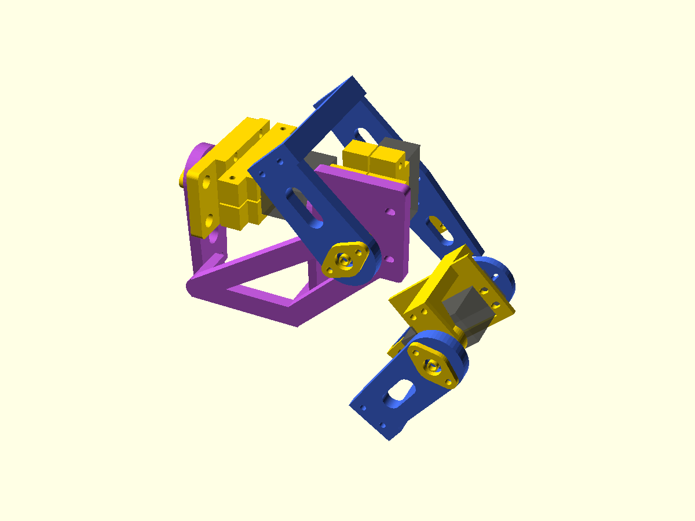

# Integrated3DOF bench leg — integrated-bench-1

This is an experimental print/unpowered-fit checkpoint. Use the original
integrated hip, mirrored upper/lower pitch forks and mirrored knee saddle from
this pack. The purple hip carries the blue upper fork through the J2 cradle;
the blue upper fork carries the knee servo/support, and the blue lower fork
carries the foot. Bearings, horns and fasteners are not all drawn.

## Assemble with servo power disconnected

1. Print/test the coupons and inspect all supported interfaces as described in
   [printing](integrated-leg-printing.md). Inspect one actual MG996R, supplied horn and624 bearing.
   Keep joints supported while assembling; do not force the geared servo stops.
2. Seat the J1 bearing in the rear ring of the integrated hip. Fix the separate
   retainer with two M3x16 bolts/nuts. Put the M4x35 pivot head in the fixed
   support recess before closing access, then fit the8mm inner-ring spacer,
   bearing/hip,3mm spacer, washer and locknut. Tighten only enough to retain
   the inner ring; the shields and outer ring must not be clamped by spacers.
3. Gently sandwich J1 between its cradle halves using two M3x40 bolts. Join
   the cradle, fixed support and rib-relieved bench adapter with four M3x20
   bolts. Seat the support in the adapter's relief pockets without forcing it.
   Fix the supplied J1 horn through the integrated hip's front-ring slots with
   suitable M2 through hardware and its original centre screw. Actual hole
   count and screw reach govern; do not use a guessed centre screw.
4. Fit the J2 bearing in the upper fork's rear ring and fix the second retainer
   with two M3x16 bolts. Install its recessed M4x35 pivot,8mm front spacer,
   bearing,3mm rear spacer, washer and locknut. Clamp the J2 servo in its two
   cradle halves with two M3x40 bolts. Join cradle/support to the integrated
   hip's7mm J2 mounting face with four M3x20 bolts. Fit the supplied J2 horn
   to the upper fork's front plate and secure its original centre screw.
5. Seat the knee bearing in the lower fork's rear ring; fix the third retainer
   with two M3x16 bolts. Put the knee M4x35 pivot through the knee support's
   recessed head seat, then fit the10mm front spacer, bearing/lower fork,
   3mm rear spacer, washer and locknut. Check free rotation.
6. Join upper fork, mirrored saddle and knee support with two M3x70 bolts.
   The nominal stack is5+22+36=63mm; check actual bolt reach and coaxial
   bearing alignment before tightening. Attach the knee servo through its ears
   with four M3x12 bolts/nuts. Attach its supplied horn to the lower fork and
   use its original centre screw. The fork webs replace the old bridges:
   no M3x90 bridge bolts or separate J1 arm/tab bolts are needed.
7. Attach the foot carrier behind the lower front plate with two M3x16 bolts.
   Add the assumed18x8x1mm rubber/EVA pad at its radial end. Mount the cable
   guide with one M3x16 bolt, an ordinary washer and the12mm backing washer.
   Leave slack across moving joints and keep leads clear of horn slots,
   bearings, fork webs and screw tips.
8. Mount the adapter40mm ahead of a rigid vertical board using two standoffs
   (maximum10mm OD) and M4 anchors sized for the actual board. The J1 axis
   points forward, normal to the board. Keep the board behind the moving leg;
   independently support the assembly while attaching it. CAD does not
   establish the board's strength or anchoring.
9. Gently check free motion with power disconnected. Suggested geometric
   trials are J1 -25..30deg, J2 20..55deg, J3 60..90deg; stop on any binding,
   contact or cable tension. These are sampled geometric ranges, not approved
   servo travel or loaded limits. Check actual horn/head access before loading.

All27 M3 through bolts use nuts. There are53 ordinary washers plus one backing
washer: normally one ordinary washer at each end, except the cable guide's
backing-washer end. Use washers that fit the recesses; some positions need6mm OD.
Quantities and bench-only fixtures are in [the BOM](../manufacturing/BOM.md).

Nominal angles are [0,44.0486,78.9786]deg;70/85mm links and J2 datum[85,-18,0]mm
are unchanged. The foot reference is[85,32,-120]mm in the bench frame. Measured
contact, servo zeros and usable travel remain unset. MG996R is provisional;
MG90S is unsuitable for these load-bearing joints at the current2kg requirement.

Print/support removal, servo/horn/bearing fit, unpowered assembly and gradually
loaded strength checks are all NOT_PERFORMED. Complete robot mass is unmeasured;
the four-leg screen is2.178kg, above the2kg limit. This pack does not release
powered motion. Follow the repository's electrical commissioning procedure
before a later powered test. No extra actuator or electronics purchase is made
necessary by this mechanical checkpoint.