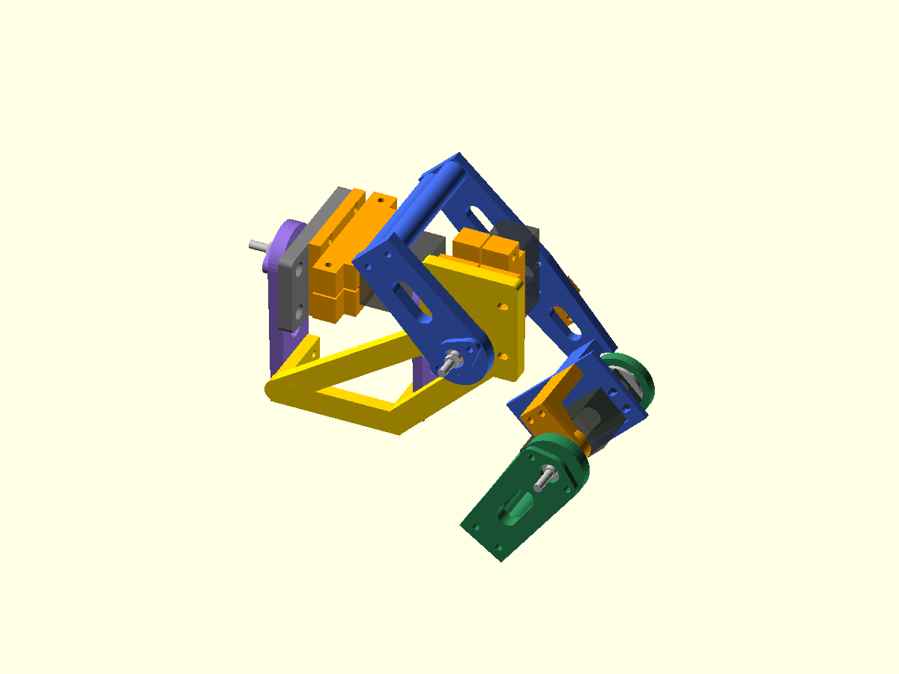

# Supported three-DOF bench leg — three-dof-bench-2

This prototype adds a supported J1 abduction joint to the existing J2/J3
pitch leg. It is a printing and unpowered fit checkpoint, not a walking robot.
The servo model and horn/bearing fit remain provisional.

## Print and buy

Use the three-DOF print manifest and hardware BOM, not the sum of earlier kits.
Reuse all current pitch-leg prints. Add one left/right cradle pair, fixed
support, front arm, rear arm, retainer, 8mm front spacer, 3mm rear spacer,
and the new J1 carrier. The existing bench adapter moves from J2 to J1;
there is only one bench adapter. Do not print an extra J1 bridge: the carrier
ties the front and rear fork arms together.

Use the current rib-relieved adapter STL from the corrected bench-2 checkpoint.
Its pockets face the passive support and provide0.2mm clearance around the ribs.
Check that the support seats freely before tightening; the older adapter had a
CAD clash. Bolt slots, anchors and hardware quantities are unchanged.

Print fit coupons first. Print the carrier flat as exported, with its tabs
upright. Start with PLA+/PETG, 0.4mm nozzle, 0.2mm layers, four walls and 30%
infill. Inspect the 3.5mm horizontal tab holes and use a brim if needed.
These process settings are assumptions; inspect the sliced part before printing.

## Assembly

1. Build the two-DOF pitch leg using its guide, omitting the bench adapter.
   Use four M3x20 bolts through its cradle, support and new 7mm carrier face.
2. Build the J1 bearing stack: 624 bearing in the rear arm, retainer with two
   M3x16 bolts, M4x35 pivot in the fixed support, 8mm front spacer, bearing,
   3mm rear spacer, washer and locking nut. Tighten only enough to retain
   the bearing inner ring; verify free rotation and no shield contact.
3. Orient both J1 fork arms downward, 90 degrees from their original bench
   orientation. Attach their distal two holes to the carrier end tabs using
   four M3x20 bolts with nuts and washers. The carrier tabs have 14mm hole
   spacing, at 21mm and 35mm above the carrier print bed. Fit all four bolts
   loosely before tightening. Do not force misaligned arms into position.
4. Clamp the J1 servo with two M3x40 bolts. Attach its cradle, fixed support
   and the relocated bench adapter with four M3x20 bolts. Assemble the
   recessed M4 pivot before closing access with the cradle.
5. Attach the supplied J1 horn to the front arm with matching M2 through
   bolts and its original centre screw. Horn holes/count/length are actual
   fit checks. Do not substitute a guessed screw for the centre screw.
6. Mount the J1 adapter 40mm ahead of a rigid vertical board using two
   maximum-10mm-OD standoffs and M4 anchors selected for the actual board.
   J1's axis points forward, normal to the board. The modeled bracket is
   not the board or a certification of its strength. Independently support
   the leg while assembling and ensure the board lies behind moving parts.
7. Route the J1 lead on the fixed side. Leave a slack loop from the moving
   pitch leg around J1; use soft ties on the carrier without trapping leads
   against horn slots, bearings or end tabs.
8. Gently check all joints by hand, staying away from geared servo stops.
   Suggested geometric trial poses: J1 -25..30 degrees, J2 20..55 degrees,
   J3 60..90 degrees. Samples do not qualify every combination or real
   cables/fasteners. Reduce travel immediately if anything touches or binds.

## Frame and limits

Body axes are forward +x, left +y and up +z. This reference-left bench leg
has J1 about +x. J2's floor datum is [85,-18,0]mm in the J1 frame;
the nominal foot plane is +32mm outward and the contact is 120mm below J1
at the retained standing pose. Positive J1 moves the foot outward.
The 85mm forward offset is a deliberately generous bench carrier; chassis
mounting and four-leg symmetry remain a later integration decision.
The original 25mm-offset skeleton remains historical reference geometry.

The 2kg/three-support-leg J1 screen uses 6.54N ground force and 0.12Nm
moving-part allowance. Stall torque is not continuous torque. No powered
loading is released. Measure supply voltage/current, polarity and actual
servo behaviour before a later powered trial; never power servos through
the ESP32 board. Final robot mass and loaded range are unresolved.

Next physical milestone: print the coupons, verify an actual servo and bearing,
then assemble this leg unpowered. Electronics/chassis work has not begun.
