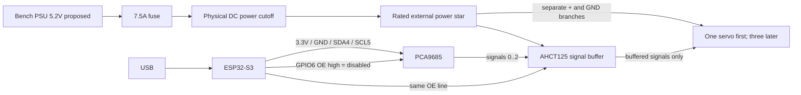

# Bench power and individual-servo bring-up — ELEC-001

This is a proposed test harness, not a released robot power system.
Begin with one unmounted servo and its horn removed. No battery/BEC, PCB or
full-robot power component is selected. Actual PSU capability and pinout are pending.

All grounds join at the power star. Servo current must not flow through the
ESP32, a solderless breadboard, or unverified PCA9685 module power tracks.
Leave the module V+ servo rail unused; connect each servo's power pair directly
to the rated external distribution. Breadboard use is limited to logic.

## Proposed connections

| From | To | Check |
|---|---|---|
| ESP32 3V3 | PCA9685 VCC | I2C pull-ups must also be3.3V |
| GPIO4 / GPIO5 | SDA / SCL | Provisional ESP32-S3-DevKitC-1 mapping; verify your board |
| GPIO6 through220ohm | OE line | HIGH disables PWM;1kohm pull-up to3V3 |
| OE line | PCA OE and AHCT pins1,4,10 | Remove/conflict-check module OE pulldown; verify high with MCU disconnected |
| Switched servo rail | AHCT pin14 |5.2V nominal, never above5.3V in this harness |
| Common GND | AHCT pin7 |0.1uF ceramic directly between14/7 |
| PCA outputs0/1/2 | AHCT inputs2/5/9 |10kohm pulldown on each input |
| AHCT outputs3/6/8 | Servo signals J1/J2/J3 |220ohm series,10kohm pulldown at each signal connector |
| AHCT unused input12 | GND | Unused OE13 to its VCC; output11 unconnected |

Use AHCT, not a guessed HC substitute. Buffering avoids relying on an
unpublished servo input threshold. [TI's SN74AHCT125 datasheet](https://www.ti.com/lit/ds/symlink/sn74ahct125.pdf)
specifies its TTL-compatible input and4.5–5.5V supply. The buffer's supply is
switched with servo power so the physical cutoff removes both motor power
and the source of high-level servo signals. It is not a safety-rated stop.

Some PWM modules pull OE down. The1kohm pull-up is only a proposed default;
inspect the actual board and confirm OE exceeds0.7×3.3V before using it.
With a10kohm board pulldown the divider gives3.0V; a hard-grounded OE must
be corrected before connection. GPIO low must stay below0.8V for the buffer.
The [NXP datasheet](https://www.nxp.com/docs/en/data-sheet/PCA9685.pdf) defines
OE and configurable disabled-output states. Configure MODE2=0x04 so OE high
forces LOW; write all channels full-off before any explicit arming.

## Current and wire screen

[TowerPro's candidate data](https://towerpro.com.tw/product/mg996r/) lists4.8–6.6V,
1.4A stall and170mA no-load current. Those values do not establish the current
of an unverified delivered servo. Use2A per servo as a planning allowance:
one3-servo leg6A, plus25% capacity margin gives7.5A. An8–10A bench supply is
a proposed capacity target, not a new purchase requirement if existing equipment
can support staged testing. Do not command three servos from a smaller supply
without measurements. No twelve-servo regulator is selected.

Proposed main feed:18AWG copper, at most0.5m each direction; branches22AWG,
at most0.3m each direction. Use terminals/cutoff/connector assemblies rated
at least10A for the main path and at least2A per branch, verified from their
actual manufacturer data. The7.5A main fuse protects the feed; PSU current
limiting is still needed for initial single-servo tests. Fuse choice and wire
insulation/temperature rating must be checked against the actual harness.

`node electronics/check-bench-power.mjs` checks the wire-only drop/current
screen. Plug losses, supplied leads and temperature are excluded. Measure
voltage at the servo during motion;5.2V here leaves margin above4.8V while
remaining inside the buffer range. This is not a qualified transient design.

## First test sequence

1. Servo rail OFF; verify polarity, common ground, logic voltages and OE high.
2. MCU initializes full-off outputs with OE high; verify no servo pulses.
3. Connect one secured servo with horn removed. Start at a modest current limit,
   e.g.0.5A; if the PSU limits or voltage collapses, stop and diagnose first.
4. Enable5.2V only after confirming the actual servo's permitted voltage.
5. Explicitly arm one channel at the nominal1500us centre; expect it may move
   to an unknown centre. Initial software window1450..1550us only,50Hz.
6. Make small moves, record rail voltage/current, noise and heating. Do not
   force a stalled shaft or raise current to overcome mechanical binding.
7. Disarm and use the physical power cutoff before moving wires or fitting horns.

Removing PWM can leave a digital servo holding its last position. OE/full-off
are signal controls; the physical power cutoff is the actual power isolation.
No powered test or supply capability is claimed. The MCU GPIO proposal is based
on [Espressif's board guide](https://docs.espressif.com/projects/esp-idf/en/v4.4.3/esp32s3/hw-reference/esp32s3/user-guide-devkitc-1.html).
