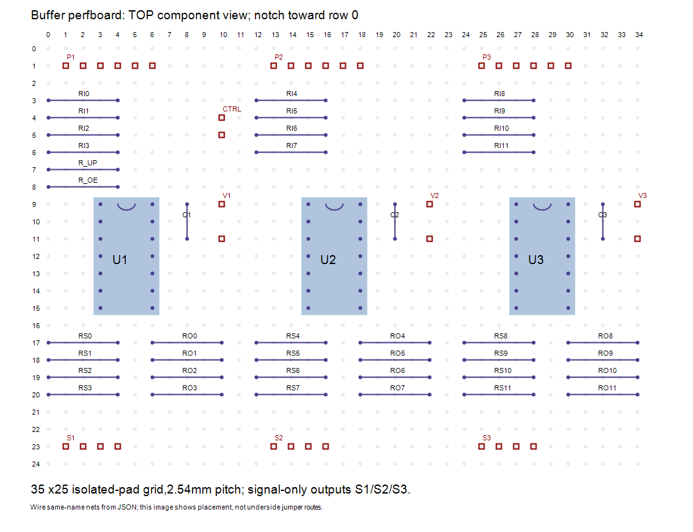

# Signal-buffer perfboard carrier — ELEC-006

Use a nominal100 x70mm isolated-pad perfboard with at least35 x25 usable holes
on2.54mm pitch. This is a provisional hand-wired layout, not a custom PCB or
a verified purchased board. Actual hole grid, socket/component bodies and
mount clearance require a dry fit before soldering. Never use uncut stripboard
for this plan: its copper strips would join unrelated nets.

Top component view: columns increase right, rows increase down. All three DIP
notches point toward row0. Pins1..7 run down the left socket column;14..8 run
down the right. U1 left/right columns3/6, U2 15/18, U3 27/30; rows9..15.
The column separation is7.62mm. Mirror the grid when viewing the solder side;
mark pin1 and an asymmetric board corner before turning it over.

## Placement and connections

| Item | Grid rule, zero-based |
| --- | --- |
| U1/U2/U3 base column |0 /12 /24 |
| Input10k RI0..RI11 | local columns0 to4, rows3..6 by gate |
| Signal220ohm RS0..RS11 | local columns0 to4, rows17..20 by gate |
| Output10k RO0..RO11 | local columns6 to10, rows17..20 by gate |
|100nF C1/C2/C3 | local column8, rows9 and11 |
| Six-pin PCA header P1/P2/P3 | local columns1..6,row1; four input signals,OE,3V3 |
| Four-pin signal header S1/S2/S3 | local columns1..4,row23; signals only |
| Buffer supply V1/V2/V3 | local column10,rows9(+5.2V) and11(GND) |
| Common OE220ohm R_OE | columns0 to4,row8 |
| Common OE1k R_UP | columns0 to4,row7 |
| CTRL GPIO6/GND | column10,rows4/5 |

The JSON lists every terminal and complete net endpoints, including chip pins.
Wire endpoints with the same net name together using insulated point-to-point
wires on the solder side; different net names must never share bare copper.
This gives a connection plan, not guaranteed non-crossing wire routes. Keep
wire runs short and inspect crossings for insulation. Axial resistors span
10.16mm; choose parts that fit or adjust before soldering. Capacitor lead
spacing here is5.08mm; adapt leads without bridging adjacent pads. Each C
is placed beside its chip supply pins; connect to14/7 by the shortest practical
paths. Sockets permit inexpensive chip replacement.

P1 carries PCA0..3,P2 4..7,P3 8..11. S1/S2/S3 carry corresponding buffered
signals. Label each lead with the leg/joint from four-leg-harness.md. Do not
connect servo motor-positive or motor-return wires to these headers. V1..V3
supply only the buffers from the common switched5.2V rail and logic reference
ground; they are not motor distribution connectors. Never join split regulator
outputs through these headers. OE headers form one shared net, not three
GPIO drivers. R_UP pulls OE to logic3.3V, not servo5.2V.

## Build and inspect later

Fit sockets and headers without solder first, mark orientation/labels, then
fit passives and insulated jumpers. Mount on insulating supports with access
to both sides. The electronics deck slots can hold a removable insulating
carrier; actual mounting holes and installed clearance remain TBD. This buffer
board adds an unmeasured100 x70mm space claim and is not incorporated into
the current chassis/mass model. Avoid stacking across USB or antenna access.

Before chips/servos are connected, check every same-net continuity and no
short between3.3V,5.2V and GND. Check each signal independently against the
JSON. Power/verify the original one-servo bench harness first; no12-servo
activation or powered result is claimed. OE level, buffer rail and physical
cutoff behavior must be measured on the assembled board.

Buying delta: one suitable isolated-pad perfboard, three14-pin DIP sockets,
three six-pin signal input headers, three four-pin signal output headers,
three two-terminal buffer supply connectors and one two-terminal CTRL header;
reuse existing resistor/capacitor/buffer totals. No purchased board geometry,
connector rating or retail price is selected. Exact hardware is provisional.
Check:node electronics/check-buffer-perfboard.mjs.

User preference:initial prototypes use perfboard; consider SMT for the final
design after hardware behavior is demonstrated. DigiKey is the preferred
supplier. Final package pinouts/footprints must be checked independently;
the PDIP layout is not a ready-made SMT PCB design.
