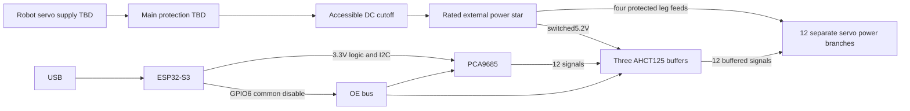

# Provisional four-leg harness — ELEC-004

This offline wiring plan extends the bench architecture; it does not enable
powered four-leg control. Actual board headers, delivered servo current and
robot supply remain unverified. The one-servo commissioning procedure stays
in bench-wiring.md. MG996R candidates only; direction/angle calibration remains
unset. Rear-leg joint labels do not imply global-forward motion.

## Signal connections

ESP32 GPIO4/5 to PCA SDA/SCL, VCC and pull-ups3.3V, address0x40 provisional.
GPIO6 through220ohm to common OE; one1kohm pull-up to logic3.3V. Connect OE
to PCA OE and pins1,4,10,13 on all three buffers. HIGH disables outputs.
Each buffer: pin14 to switched servo rail, pin7 to common ground, one100nF
ceramic at14/7. Orient the PDIP notch before counting pins; other packages
need their own verified pinout. All12 gates are used.

| PCA channel | Leg/joint | Buffer/gate | A input | Y output | OE |
| --- | --- | --- | ---: | ---: | ---: |
| 0 | FL/J1 | U1/1 | 2 | 3 | 1 |
| 1 | FL/J2 | U1/2 | 5 | 6 | 4 |
| 2 | FL/J3 | U1/3 | 9 | 8 | 10 |
| 3 | FR/J1 | U1/4 | 12 | 11 | 13 |
| 4 | FR/J2 | U2/1 | 2 | 3 | 1 |
| 5 | FR/J3 | U2/2 | 5 | 6 | 4 |
| 6 | RL/J1 | U2/3 | 9 | 8 | 10 |
| 7 | RL/J2 | U2/4 | 12 | 11 | 13 |
| 8 | RL/J3 | U3/1 | 2 | 3 | 1 |
| 9 | RR/J1 | U3/2 | 5 | 6 | 4 |
| 10 | RR/J2 | U3/3 | 9 | 8 | 10 |
| 11 | RR/J3 | U3/4 | 12 | 11 | 13 |

Each A input has10kohm to ground. Each Y output goes through220ohm to its
servo signal connector, with10kohm to ground at the connector. Label both ends
FL/FR/RL/RR and J1/J2/J3. Verify actual servo wire polarity; do not rely on
colours. Three chips are the minimum for12 signals; contiguous four-channel
chip groups simplify pin numbering, although they cross leg boundaries.
PCA12–14 stay full-off/unconnected;15 remains the board-only timing loopback.

The [TI datasheet](https://www.ti.com/lit/ds/symlink/sn74ahct125.pdf) supplies
the14-pin gate map, TTL input limits and4.5–5.5V operating range. Our existing
harness limit stays5.3V maximum. [NXP](https://www.nxp.com/docs/en/data-sheet/PCA9685.pdf)
defines16 PWM outputs, common OE and configurable disabled-output states.
PCA MODE2=0x04 and full-off initialization remain required before later arming.
This task changes no firmware. Module OE pulldown conflicts must be checked;
verify OE high with MCU disconnected and every buffer powered before motion.

## Power boundary and purchases

Each servo receives its own positive/ground pair from the external distribution;
no motor current through ESP32, breadboard or PCA V+ tracks. PCA V+ remains unused.
Connect logic and buffer grounds to the star without routing servo return
current through their boards. Switched motor power also supplies the buffers.
The physical cutoff must be accessible outside the moving legs. OE is signal
disable, not power isolation; a servo can retain its last commanded position.

Reuse2A per-servo allowance:6A per leg,24A total;25% capacity margin gives
7.5A per leg and30A total planning capacity. This is a sizing warning, not
a measured requirement or a selected30A supply. The bench5A supply/10A path
is not a released full-robot supply. Robot battery, regulator, main fuse,
main wire and connectors remain TBD; ratings, voltage drop and protection
coordination need checking when actual current and supply are chosen. The
existing18/22AWG bench recipe must not be copied into a24A main feed.

Conditional signal totals:3 AHCT125N,3 x100nF ceramics,13 x220ohm resistors
(12 signal+oneOE),24 x10kohm pulldowns andone1kohm OE pull-up. Relative to
the bench signal harness, add2 buffers,2 capacitors,9 output paths,9 series
resistors and18 pulldowns; share the existing OE resistor/pull-up. These are
totals, not quantities to add twice. Owned controller boards need no replacement.
Use perfboard/sockets for logic; rated distribution handles power. No new
regulator/battery purchase or verified retail price is claimed. Buy/test one
servo before committing to the full harness. Check the3.3V and5.2V domains,
continuity, polarity, OE disabled state and one channel at a time on hardware.

Data:four-leg-harness.json. Check:node electronics/check-four-leg-harness.mjs.
All physical tests remain NOT_PERFORMED; this is a provisional connection plan.
