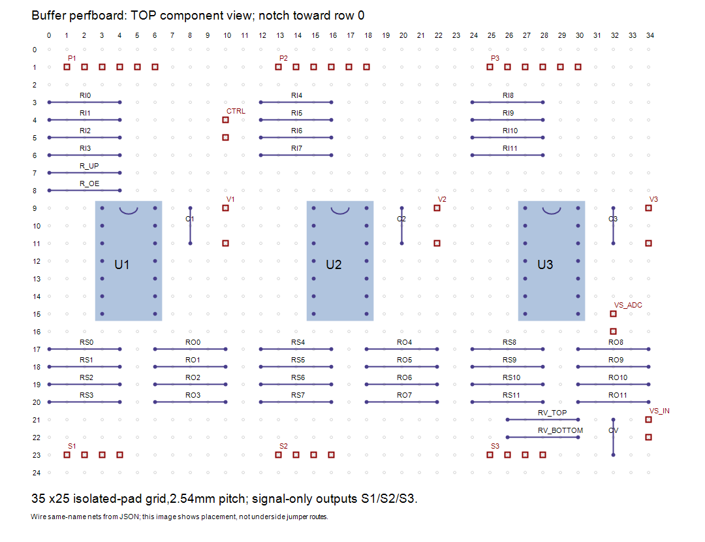

# Removable perfboard voltage input — ELEC-008

This optional input prepares voltage measurements using the owned ESP32-S3,
multimeter and adjustable supply. It is a **manual bench diagnostic**, not an
always-connected battery monitor or battery protection system. No battery is
selected. Positive test voltage is limited to0..25.2V; never connect60V or a
negative voltage. The voltage source must not be wired to the servo rail while
performing this diagnostic; keep servo power OFF and disconnect all servos.

## Circuit and perfboard placement

```text
VS_IN + -- RV_TOP 150k --+-- VS_ADC signal --> GPIO8 (ADC1_CH7)
                        |
                        +-- RV_BOTTOM 10k -- GND
                        |
                        +-- CV 100nF ------- GND
VS_IN GND --------------+-- VS_ADC GND ----- ESP32 GND
```

Both resistors are axial5%,1/8W; CV is the same50V X7R100nF radial part as
buffer decoupling. Connect all same-name nets using insulated jumpers. The
source/input terminal must connect only through RV_TOP to ADC8. This is a
sense-current branch, not a motor-power branch. Check GND continuity first.



The optional addon fits unused positions in the existing35 x25 logical grid;
its file is voltage-perfboard-addon.json. Top view, zero-based coordinates:

| Item | Pads and net order |
| --- | --- |
| RV_TOP150k | columns26/30,row21; SENSE_POS/ADC8 |
| RV_BOTTOM10k | columns26/30,row22; ADC8/GND |
| CV100nF | column32,rows21/23; ADC8/GND |
| VS_IN2-pin header | column34,rows21/22; SENSE_POS/GND |
| VS_ADC2-pin header | column32,rows15/16; ADC8/GND |

The checker finds172 unique pads including the original162; no original nets
or components move. The resistor lead span is10.16mm, cap spacing5.08mm.
Actual socket/header bodies, solder crossings and mounting remain dry-fit
checks. These headers are unkeyed: mark +,GND and ADC8 before connecting.
Do not confuse the sense-input connector with the5.2V buffer supply connector.
Verify actual ESP32 board GPIO8 location and that it is unused before wiring.
[Espressif GPIO mapping](https://docs.espressif.com/projects/esp-idf/en/release-v5.3/esp32s3/api-reference/peripherals/gpio.html)
identifies GPIO8 as ADC1_CH7; GPIO4..7 remain assigned to I2C/OE/timing.

## Minimum electrical checks

Nominal divider is16:1:5.2V gives325mV at ADC8;25.2V gives1.575V.
Worst5% resistor combination gives1.7294V at25.2V. This remains below a
conservative2.0V diagnostic ceiling and the published older2.5V ADC range
at11dB attenuation. Conservative resistor powers are under4.34mW/0.30mW,
well below125mW ratings. Equivalent source resistance9.375k with100nF gives
0.938ms RC; the diagnostic waits5ms then takes16 pairs with1ms waits.
[Espressif ADC guidance](https://docs.espressif.com/projects/esp-idf/en/v4.4.7/esp32s3/api-reference/peripherals/adc.html)
and [hardware filter recommendation](https://documentation.espressif.com/projects/esp-hardware-design-guidelines/en/latest/esp32s3/schematic-checklist.html).

This divider is not precision-calibrated:5% individual resistors can cause
roughly10% scale error, and ADC error adds to it. Compare against the multimeter
before using readings for any decision. Firmware reports an estimate using
nominal16:1 scaling. ADC software limits do not physically protect an input.
A missing ground, incorrect resistor or excessive voltage can still damage it.

## Power sequencing and later comparison

1. Leave the sense positive disconnected and servo power OFF. With ESP32
   disconnected, inspect polarity, continuity and resistor values. Connect
   supply negative to circuit GND; set a low current limit suitable for this
   tiny circuit. Independently check the divider output with the multimeter
   at a modest input voltage before ever plugging it into GPIO8.
2. Turn the test source OFF/disconnect its positive. Connect verified GPIO8/GND
   and power the ESP32 from USB first. PCA logic must be connected as in the
   existing bench harness so the controller can initialize DISARMED. Connect
   the sense positive last, then enable only the separate test source.
3. From a manual serial terminal at115200 baud, while DISARMED, enter exactly
   `voltage rail-off no-servos`. The existing supervised console does not yet
   expose this command. Operator words acknowledge setup; they are not voltage
   measurements. Firmware reasserts OE high/full-off and never enables outputs.
4. Compare source voltage and ADC-node voltage measured by the multimeter with
   `input_mv` and `adc_mv`. Start around5.2V, then optionally12V and25.2V on
   the **sense circuit only**, after confirming wiring. Record actual readings
   and spread; no such readings have been made yet. Do not infer accuracy from
   an example output or synthetic host test.
5. Turn OFF/disconnect sense positive **before** removing ESP32 USB power;
   wait at least10ms for the filter to discharge. Never leave this input
   connected to a live battery while ESP32 is unpowered. No powered-off
   isolation/clamp is provided by this manual prototype. An always-connected
   onboard implementation needs a separately checked isolation arrangement.

Response fields: result,adc_mv,input_mv,spread_mv,raw,samples,calibrated=false.
`READING` means a complete software acquisition, not physical accuracy approval.
`LOW_OR_DISCONNECTED` can mean low input, an open lead or ADC calibration failure;
never interpret it as a confirmed dead battery. A raw4095 or ADC value above
2000mV rejects the acquisition. A read failure/partial acquisition yields no
input estimate. Raw and calibrated values are successive conversions, not
identical simultaneous samples. No battery chemistry/cutoff threshold is set.
An armed request latches the existing command fault and disables outputs;
a faulted request cannot recover the controller. It does not extend keepalive.

## Buying delta and validation

Optional delta: one150k axial resistor (CF18JT150K candidate; DigiKey preferred,
[public listing](https://www.digikey.co.nz/en/products/detail/stackpole-electronics-inc/CF18JT150K/1741592)),
one10k CF18JT10K0 and one C322C104K5R5TA100nF. Reuse the spare10k from the
25-pack and cut two2-pin headers from the spare positions in the two40-pin
strips. Reuse suitable existing wire/board/components. Otherwise budget roughly
NZ$2–3 for the small passive delta, subject to checkout prices and shipping;
this is an estimate, not an additional verified quotation. The original
DigiKey buffer subtotal stays32.82 and does not include this optional addon.

Independent check:`node electronics/check-voltage-perfboard.mjs`.
Firmware:`firmware/test.ps1` and `firmware/build.ps1` using existing local tools.
No firmware upload, electrical measurements or automatic battery cutoff occurs.
