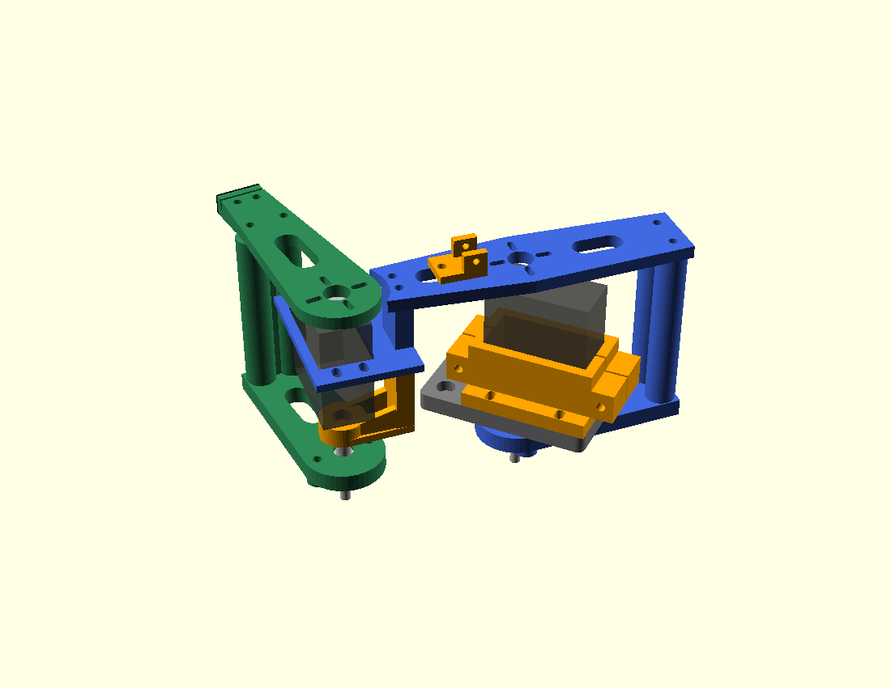

# Supported two-DOF pitch-leg print kit — MEC-134–143

This kit adds the knee passive support and85mm lower link to the70mm upper
link. Both pitch joints have rear bearing support. J1 abduction is still absent;
this is not yet a3DOF leg. No physical assembly or powered tests were performed.

## Print and fit

Use ../release-manifest.json for part quantities. Most parts
are shared with the earlier kits; do not print the superseded hip front arm.
Print the original cradle, horn and bearing coupons plus the knee-ear coupon
first. Servo case, shaft offset, ear height/hole pitch, horn face and bearing
fit remain assumptions until checked on one actual unit.

Print each STL as exported at z=0, with0.4mm nozzle,0.2mm layers and PLA+/PETG.
Use four walls and about30% infill as starting settings. Links print flat;
bridges upright with brims. The knee support prints on its base without added
supports. Check small inner-ring spacers for clean walls; metal equivalents
are acceptable if printed spacers bind or deform. Clear small horizontal holes
carefully if needed. Slicer/print inspection replaces assumed process quality.

## Assembly sequence

1. Fit a 624 bearing into the hip rear arm and secure its retainer with two
   M3x16 bolts/nuts. Insert the M4x35 pivot into the fixed support recess,
   then fit the 8mm spacer, bearing/rear arm, 3mm spacer, washer and locking
   nut. Spacers contact only the inner ring; check smooth rotation.
   Join the rear arm and upper plate with the bridge and two M3x90 bolts.
   Clamp the servo gently between cradle halves using two M3x40 bolts.
   Mount cradle/support/bench adapter with four M3x20 bolts; assemble the
   recessed pivot first. Attach the supplied horn to the upper plate through
   its slots, then use the original servo centre screw. Check screw tips,
   actual horn geometry and case alignment. The upper plate is
   replacing its short front arm. Hip bridge is on the opposite side; rear
   arm rotates180deg in its plane. Reuse its8mm front spacer and3mm rear spacer.
2. Seat the knee bearing in the second existing rear arm and add its retainer.
   Insert the knee M4 pivot through the new support's head recess before the
   support is attached. Add the10mm front spacer, bearing,3mm rear spacer,
   washer and locking nut. Tighten lightly; spacers touch only the inner ring.
3. Fit the support underneath the knee saddle. Replace its two previous
   M3x40 joining bolts with M3x70: upper plate5+saddle22+support36=63mm stack.
   Use washers/nuts. Check bearing coaxial alignment and actual screw reach.
4. Attach the knee servo by its ears using four M3x12 bolts/nuts, then mount the lower front link on the
   supplied horn with through bolts and the original centre screw. Use the
   second66.2mm bridge and twoM3x90 bolts to join front/rear arms. Hand motion
   must remain free without servo-case slip or shield/washer contact.
5. Attach the foot carrier behind the lower front plate with twoM3x16 bolts.
   Its end wall remains beyond the link tip. An18x8x1mm rubber/EVA piece on
   that radial end gives85mm knee/contact reference. Different thickness or
   compression changes actual contact and must be measured.
6. Clamp the cable guide onto the negative upper-plate window using oneM3x16
   bolt, ordinary washer above and12mm OD backing washer below. Mounting
   hole is x=-30.5mm; guide origin=-24.5mm. Leave slack and tie gently. Keep
   wires away from rotating horns, bridge columns and fastener tips.

Follow ../BOM.md for quantities; old hardware lists are replaced,
not added. Actual horn screw length and cable routing remain fit checks.

## Bench fixture

The revised7mm adapter is below the fixed hip support, top z=-3mm and back
z=-10mm. Its22mm opening clears the pivot boss. The original5mm broad flat
plate was rejected during assembly review because it occupied the boss/sweep
space; final source/export uses the compact negative-x anchor layout.

Use fourM3x20 cradle/support/adapter bolts, with heads behind the adapter and
nuts on the cradle flange. Small6mm OD washers aid access. Head depth must
clear the rear arm. Mount the adapter40mm ahead of a rigid vertical board via
two maximum10mm OD standoffs and M4 anchors at x=-35,y=+/-12mm in adapter
coordinates. Example M4x70 suits a12mm board; choose length for actual material.
Heads seat in recessed pockets; washers are on the board/nut side. The board
is behind the rear-arm space. The CAD does not supply a bench or certify its
anchoring: confirm it is rigid and all parts clear before loading.

The source uses local z along the pitch shafts. For standing orientation,
local x points upward, local y backward and local z laterally; do not put the
rear fork directly against a solid tabletop or mounting wall.

## Verification and2kg limits

The recorded source verification in ../validation.json checks six new
connected closed STL meshes,70/85mm nominal closure, sampled bridge/fixture
clearance and saved exact front-plate probes. Front-arm/upper-plate modeled
intersections are empty at20,79 and90deg knee flexion. The bridge is checked
at1deg samples over20–90deg, minimum conservative margin1.16mm after0.8mm
allowance. Actual screws, horns, cables, limits and pad compliance are not
qualified by those checks. The nominal assembly render was visually reviewed.

User changed the maximum COMPLETE robot mass to2kg on2026-10-08. The new
three-support-leg static screen uses6.54N per leg,49mm knee lever and0.10Nm
moving-parts allowance: about0.42Nm versus0.92Nm published4.8V stall torque.
This justifies a bent-pose prototype trial, not continuous operation. A full
horizontal155mm leg exceeds that stall comparison: do not treat desired joint
ranges as approved loaded motion. Historical1.2kg reports were not rescaled.

Printed pitch-leg solid mass is about156g, excluding the bench adapter; actual
infill and measured mass supersede it. Two servos add110g. Final3DOF/four-leg
mass, J1 torque and electrical power capacity remain unverified. Budget limits
are unchanged. Never power servos through the ESP32 board.

Only unpowered fit/motion checks are ready for the user. Powered work requires
the actual supply voltage/current, polarity and suitable PWM source to be
checked first. No measurement or acceptance is claimed by these instructions.

Not included in this package: the J1 abduction carrier connecting this
pitch-leg module to the third servo, with the minimum spacing/torque check.
It is not started in this batch. No chassis/electronics stage started.

Fit coupon IDs: cradle coupon, bearing coupon (1/2/3 dots = 13.0/13.2/13.4mm seats), horn coupon and upper-leg ear coupon. Files are in ../coupons; print one each before the full kit. The current rear-arm bearing seat is 13.2mm. Failed fit requires a design revision and regenerated pack.
